# Quantum Algorithms and Circuits for Topological Phases

Quantum-circuit studies of topological phases and anyonic systems, particularly
Fibonacci anyons: preparing string-net ground states, creating and braiding
excitations, and executing arbitrary braid words as logical gates. Together,
these operations effectively emulate a topological quantum computer on
conventional gate-based hardware. The circuit constructions are validated using
Qiskit simulations and symbolic derivations in Mathematica, and optimized
for IBM Quantum systems with hardware-aware transpilation.

The circuits provide ingredients for studying non-Abelian encoding and error
correction.

Other models included are:

- Toric-code ground-state preparation and modular-matrix measurements.
- A cluster-state symmetry-protected topological phase transition.

## Contents <!-- omit from toc -->
- [Fibonacci Anyons: Quantum Algorithms and Optimized Circuits](#fibonacci-anyons-quantum-algorithms-and-optimized-circuits)
  - [The Fibonacci String-net model](#the-fibonacci-string-net-model)
  - [Two circuit models](#two-circuit-models)
  - [Ground-state preparation](#ground-state-preparation)
  - [Creating, braiding and fusing anyons](#creating-braiding-and-fusing-anyons)
  - [Braiding simulations and topological gates](#braiding-simulations-and-topological-gates)
  - [Circuit transpilation and optimization](#circuit-transpilation-and-optimization)
  - [Mathematica calculations](#mathematica-calculations)
- [Toric code](#toric-code)
  - [Ground-state preparation and modular matrices](#ground-state-preparation-and-modular-matrices)
- [Cluster-state SPT phase transition](#cluster-state-spt-phase-transition)
  - [Overview](#overview)
  - [iMPS and sequential circuit construction](#imps-and-sequential-circuit-construction)
  - [String-order measurements](#string-order-measurements)


## Fibonacci Anyons: Quantum Algorithms and Optimized Circuits

Below we will very briefly introduce the Fibonacci string-net model and its
encoding in quantum circuits. Then we discuss ground-state preparation,
anyon creation, transport, braiding, fusion and measurement before turning to
logical braid words, circuit optimization and hardware-aware transpilation for
IBM quantum processors.

<p align="center">
  <picture>
    <source media="(prefers-color-scheme: dark)"
            srcset="docs/images/fibonacci/transpilation/transpilation_cost_by_braid_word_dark.svg">
    <source media="(prefers-color-scheme: light)"
            srcset="docs/images/fibonacci/transpilation/transpilation_cost_by_braid_word.svg">
    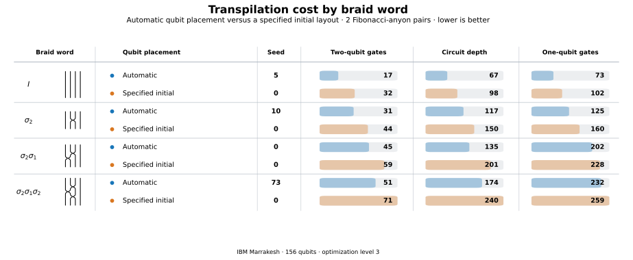
  </picture>
</p>

All the main scripts can be run as Python modules from the repository root using

```bash
python -m fibonacci.main_scripts.<model>.<script_name>
```

To use the code, set up a Python environment containing Qiskit, Qiskit Aer,
and Qiskit IBM Runtime (see [`requirements.txt`](requirements.txt)). To submit
jobs to IBM hardware, you must also configure access to IBM Quantum.

### The Fibonacci String-net model

The Fibonacci category has string labels and non-trivial fusion rule

$$
\mathcal C=\mathrm{Fib}=\{1,\tau\},
\qquad
\tau\times\tau=1\oplus\tau.
$$

The two simple objects of $\mathcal C$ are encoded directly on each edge qubit as

$$
1\longleftrightarrow|0\rangle,
\qquad
\tau\longleftrightarrow|1\rangle.
$$

A Levin-Wen ground state is a coherent superposition of fusion-allowed string
nets satisfying

$$
H=-\sum_v Q_v-\sum_p B_p,
\qquad Q_v|\Omega\rangle=B_p|\Omega\rangle=|\Omega\rangle.
$$

Here $Q_v$ enforces the fusion rule at each vertex and $B_p$ inserts a
quantum-dimension-weighted loop around a plaquette. For Fibonacci strings $d_\tau=\varphi=\frac{1+\sqrt5}{2}$, $\mathcal D_{\mathrm{Fib}}^2=1+\varphi^2$ and $B_p=\frac{B_p^1+\varphi B_p^\tau}{\mathcal D_{\mathrm{Fib}}^2}$.

String-net states can be prepared and manipulated using local recoupling moves
determined by $\mathcal C$. An $F$-move reassociates a fusion tree. Since
$\mathrm{Fib}$ is modular, it also has a braiding structure encoded by $R$-moves.
The non-trivial $F$ and $R$ symbols of
$\mathcal C=\mathrm{Fib}$, are

$$
F^{\tau\tau\tau}_\tau=
\begin{pmatrix}
\varphi^{-1} & \varphi^{-1/2}\\
\varphi^{-1/2} & -\varphi^{-1}
\end{pmatrix},
\qquad
R^{\tau\tau}_1=e^{-4\pi i/5},
\qquad
R^{\tau\tau}_\tau=e^{3\pi i/5}.
$$

We implement the recoupling $F$ as a five-qubit gate: the outer-edge qubits
$a,b,c,d$ control the transformation of the internal edge $e$:

<p align="center">
  <picture>
    <source media="(prefers-color-scheme: dark)"
            srcset="docs/images/fibonacci/diagrams/fibonacci_f_gate_dark.svg">
    <source media="(prefers-color-scheme: light)"
            srcset="docs/images/fibonacci/diagrams/fibonacci_f_gate.svg">
    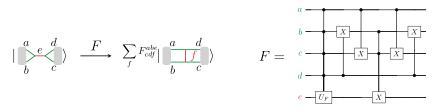
  </picture>
</p>

Here $U_F=F^{\tau\tau\tau}_\tau$. When some outer labels are fixed to
$1=|0\rangle$ or $\tau=|1\rangle$, the gate can be simplified. Some of these
specialized gates are implemented with Qiskit's uniformly controlled
(multiplexed) `UCGate`, which transpiles more efficiently to IBM Quantum hardware based on my tests. Further optimizations are described under
[Circuit transpilation and optimization](#circuit-transpilation-and-optimization).


### Two circuit models

We use these categorical gates to construct two different circuit realizations of Fibonacci anyons:

| Model | Geometry | Main purpose |
|:---|:---|:---|
| [Three-plaquette string net](fibonacci/models/levin_wen_lattice.py) | 3-plaquette Honeycomb lattice with 15 edges (qubits) | Create Levin-Wen string-net groundstate; create and move excitations along lattice ribbon paths |
| [Single-polygon topological code](fibonacci/models/topological_code.py) | Single $n$-sided plaquette with excitation tails | Encode and braid $2n$ anyons using $2n$ qubits; perform arbitrary braid words to emulate a topological quantum computer and its logical gates |

### Ground-state preparation

#### Single-polygon ground state

The polygon ground state is one weighted loop $|\Omega_n\rangle = \frac{|0\rangle^{\otimes n}+\varphi|1\rangle^{\otimes n}}{\sqrt{1+\varphi^2}}.$
This state can be created from $|0\rangle^{\otimes n}$, by applying $`U_s=\frac{1}{\sqrt{1+\varphi^2}}\begin{pmatrix}1&\varphi\\ \varphi&-1\end{pmatrix}`$ to one seed edge, followed by a CX fan around the other polygon edges.

#### Three-plaquette ground state

For three connected plaquettes, independent one-loop states cannot simply be
pasted together: shared edges and vertices must still satisfy the Fibonacci
fusion rules. [`fibonacci_ground_state`](fibonacci/models/levin_wen_lattice.py)
uses a non-trivial sequence of F-move recouplings to create the desired ground
state.

In the Mathematica notebooks (see
[Mathematica calculations](#mathematica-calculations)), we have developed tools
to explicitly visualize and manipulate string-net states in their natural
graphical language using quantum gates. There, we derive the correct string-net
amplitudes and verify the gate sequence.

The ground states can be checked using circuits that measure each vertex
constraint $\langle Q_v\rangle$ (direct edge qubit measurements) and each
plaquette constraint $\langle B_p\rangle$ (Hadamard tests). To run as
simulation:

```bash
python -m fibonacci.main_scripts.levin_wen_lattice.levin_wen_simulation_groundstate_checks
```

To run the circuits in IBM Quantum hardware, use

```bash
python -m fibonacci.main_scripts.levin_wen_lattice.levin_wen_hardware_groundstate_checks
```

Set `RUN_HARDWARE = True` in that script to submit a new run. With `RUN_HARDWARE = False`, it reloads and plots the
most recent saved measurements like this:

<p align="center">
  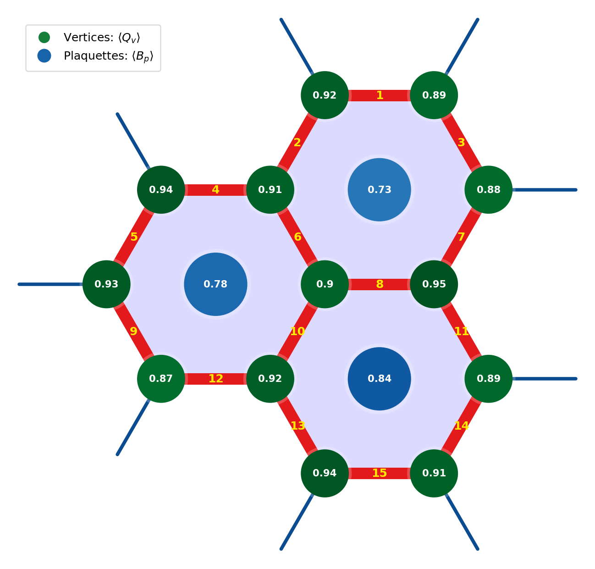
</p>

 New runs append one CSV row to
[`vertex_constraints.csv`](fibonacci/main_scripts/levin_wen_lattice/data/vertex_constraints.csv)
and
[`plaquette_constraints.csv`](fibonacci/main_scripts/levin_wen_lattice/data/plaquette_constraints.csv).


#### Subtle note: can $B_p$ be measured with a unitary circuit?

The Levin-Wen plaquette term $B_p$ is a projector, so it is not itself a
quantum gate. Instead, the circuit implements a unitary $U_\tau$ on the lattice
using two auxiliary fusion qubits: create a $\tau$ pair, carry one excitation
around the plaquette, and fuse the pair again. Projecting the auxiliary qubits
back to $|00\rangle$ selects the block
$K_\tau = \bigl(I\otimes\langle00|\bigr)U_\tau\bigl(I\otimes|00\rangle\bigr) = \frac{B_p^\tau}{\varphi}.$

The remaining auxiliary branches retain the complementary fusion information,
making the enlarged operation reversible. With the auxiliary qubits initialized
in $|00\rangle$, the Hadamard test in
[`measure_Bp_sampling`](fibonacci/constraints/plaquette.py) measures the real
overlap $\langle\psi,00|U_\tau|\psi,00\rangle=\langle\psi|K_\tau|\psi\rangle=\langle B_p^\tau\rangle/\varphi$, from which the plaquette expectation is
reconstructed as $\langle B_p\rangle = \frac{1+\varphi\langle B_p^\tau\rangle}{1+\varphi^2}=\frac{1+\varphi^2\langle K_\tau\rangle}{1+\varphi^2}.$ The operator $B_p$
is a projector because the fusion rule $\tau\times\tau=1\oplus\tau$ implies
$(B_p^\tau)^2=I+B_p^\tau$.

### Creating, braiding and fusing anyons

Having prepared the ground state $|\Omega\rangle$, we next create $\mu$-type excitations
$|\Omega_\mu\rangle=W_\mu|\Omega\rangle$ with ribbon operators and study how the
excitations braid and fuse.

The lattice strings and bulk excitations carry related but distinct labels.
The string labels are the objects of $\mathcal C=\{1,\tau\}$, while the
excitations $\mu$ are the objects

$$
\mu\in Z(\mathcal C)=\{(1,1),(1,\tau),(\tau,1),(\tau,\tau)\}.
$$

We can graphically calculate the string-net amplitudes of excited states
$|\Omega_\mu\rangle$ by inserting ribbons labelled by
$\mu\in Z(\mathcal C)$ from above and resolving them into superpositions of $\mathcal C$ strings. This uses
the forgetful functor and the half-braiding.

The forgetful functor $Z(\mathcal C)\to\mathcal C$ drops the excitation's
half-braiding data and keeps its ordinary string content. In general,
$\mathrm{For}(\mu)\cong\bigoplus_{a\in\mathcal C} n_{\mu,a}\,a$, where $n_{\mu,a}$ counts how often the string $a$ occurs. For Fibonacci, this
becomes

$$
(1,1)\mapsto1,\qquad
(1,\tau)\mapsto\tau,\qquad
(\tau,1)\mapsto\tau,\qquad
(\tau,\tau)\mapsto1\oplus\tau.
$$

Graphically, a loop labelled by $\mu\in Z(\mathcal C)$ becomes its underlying
$\mathcal C$ string or superposition of strings:

<p align="center">
  <picture>
    <source media="(prefers-color-scheme: dark)"
            srcset="docs/images/fibonacci/diagrams/center_forgetful_functor_dark.svg">
    <source media="(prefers-color-scheme: light)"
            srcset="docs/images/fibonacci/diagrams/center_forgetful_functor.svg">
    
  </picture>
</p>

An excitation acts on a string-net state through its half-braiding: moving the
$\mu$ ribbon across a string $a$ is resolved into fusion-allowed trivalent
nets with coefficient matrices $\Omega^b_{a\mu}$.

<p align="center">
  <picture>
    <source media="(prefers-color-scheme: dark)"
            srcset="docs/images/fibonacci/diagrams/half_braiding_action_dark.svg">
    <source media="(prefers-color-scheme: light)"
            srcset="docs/images/fibonacci/diagrams/half_braiding_action.svg">
    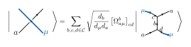
  </picture>
</p>

**Creation**

In our circuits, we will only consider the anyon $\mu=(\tau,1)$, whose underlying string after forgetting
is the ordinary string $\tau=|1\rangle$. Thus, outside the lattice, the
excitation can be represented by an open $\tau$ string; we refer to it simply
as $\tau$ from here on.

To implement this, a pair is created from the vacuum
with total charge $1$. A fresh edge qubit $e_i=|0\rangle$ supplies this identity
channel, and an $F$-move recouples the pair into the surrounding string net:

<p align="center">
  <picture>
    <source media="(prefers-color-scheme: dark)"
            srcset="docs/images/fibonacci/diagrams/anyon_fuse_into_lattice_tikz_dark.svg">
    <source media="(prefers-color-scheme: light)"
            srcset="docs/images/fibonacci/diagrams/anyon_fuse_into_lattice_tikz.svg">
    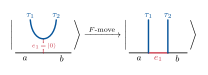
  </picture>
</p>

This local operation embeds pairs into either of the two lattice geometries we use. On the
3-plaquette system:

<p align="center">
  <picture>
    <source media="(prefers-color-scheme: dark)"
            srcset="docs/images/fibonacci/diagrams/three_plaquette_anyon_creation_tikz_dark.svg">
    <source media="(prefers-color-scheme: light)"
            srcset="docs/images/fibonacci/diagrams/three_plaquette_anyon_creation_tikz.svg">
    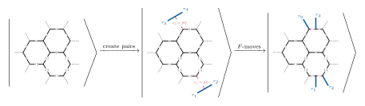
  </picture>
</p>

On the single polygon, `num_pairs = n` creates $n$ pairs, or $2n$ anyons,
around the plaquette. The example below creates four pairs from the 4-sided
polygon ground-state:

<p align="center">
  <picture>
    <source media="(prefers-color-scheme: dark)"
            srcset="docs/images/fibonacci/diagrams/polygon_four_pair_anyon_creation_tikz_dark.svg">
    <source media="(prefers-color-scheme: light)"
            srcset="docs/images/fibonacci/diagrams/polygon_four_pair_anyon_creation_tikz.svg">
    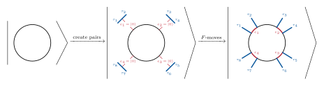
  </picture>
</p>

**Braiding**

Next, we can braid neighbouring anyons using local gates. $F$-moves change the local fusion tree and $R$-moves flip the tails. For example, the middle braid $\sigma_2$ exchanges
$\tau_2$ and $\tau_3$ through local $R$-, $F$- and inverse-$R$ moves:

<p align="center">
  <picture>
    <source media="(prefers-color-scheme: dark)"
            srcset="docs/images/fibonacci/diagrams/sigma2_braid_local_moves_tikz_dark.svg">
    <source media="(prefers-color-scheme: light)"
            srcset="docs/images/fibonacci/diagrams/sigma2_braid_local_moves_tikz.svg">
    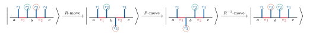
  </picture>
</p>

Note that the $R$-move corresponds to the twisting of the ribbon.

**Annihilation**

Finally, $F$-moves recouple the anyons out of the lattice. Measuring each
resulting $e_i$ edge qubits reads the pair's fusion charge: bit $0$ means $1$, while
bit $1$ means $\tau$.

<p align="center">
  <picture>
    <source media="(prefers-color-scheme: dark)"
            srcset="docs/images/fibonacci/diagrams/anyon_fuse_out_and_measure_tikz_dark.svg">
    <source media="(prefers-color-scheme: light)"
            srcset="docs/images/fibonacci/diagrams/anyon_fuse_out_and_measure_tikz.svg">
    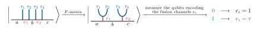
  </picture>
</p>

**Ribbon transport**

In the three-plaquette model, anyons can also be transported and braided along
any valid ribbon path.
The function [`move_tail_along_path`](fibonacci/gates/anyonic_gates.py) transports an anyon
along a user-defined path using local $F$-moves, with $R$-moves accounting for
ribbon twists.
[`fibonacci_closedLoops`](fibonacci/models/levin_wen_lattice.py) applies this
construction to one created pair along various closed ribbon paths, then fuses
the pair back out to verify that the ground state is preserved.

<p align="center">
  <picture>
    <source media="(prefers-color-scheme: dark)"
            srcset="docs/images/fibonacci/diagrams/ribbon_transport_local_moves_tikz_dark.svg">
    <source media="(prefers-color-scheme: light)"
            srcset="docs/images/fibonacci/diagrams/ribbon_transport_local_moves_tikz.svg">
    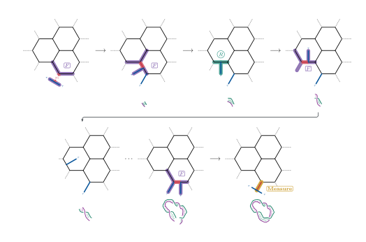
  </picture>
</p>

Below each figure, we have drawn the ribbon that the two tails trace as they move around the plaquette.

### Braiding simulations and topological gates

#### Arbitrary braid words

The [single-polygon model](fibonacci/models/topological_code.py) provides the
function

```python
def fibonacci_code(num_pairs, topological_gates, measurement_optimized: bool = True) -> QuantumCircuit:
```

It returns a circuit that creates $2n$ anyons for `num_pairs=n`, applies the
braid word given by `topological_gates`, annihilates the pairs, and measures
their fusion outcomes.
The braid word is composed of generators $\sigma_i$ and their inverses: `s1`,
`s2`, ... denote
$\sigma_1,\sigma_2,\ldots$, while `si1`, `si2`, ... denote their inverses. The
Python list is applied from left to right in circuit time. As an
example, consider the pure braid

$$
B=
(\sigma_2\sigma_1^2\sigma_2^{-1})
(\sigma_3\sigma_2^2\sigma_3^{-1}).
$$

Since the mathematical product acts rightmost
first, its circuit-time list is

```python
topological_gates = [
    "si3", "s2", "s2", "s3",
    "si2", "s1", "s1", "s2",
]
```

Reading from left to right, the corresponding braid is

<p align="center">
  <picture>
    <source media="(prefers-color-scheme: dark)"
            srcset="docs/images/fibonacci/diagrams/braid_word_pure_example_tikz_dark.svg">
    <source media="(prefers-color-scheme: light)"
            srcset="docs/images/fibonacci/diagrams/braid_word_pure_example_tikz.svg">
    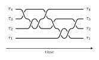
  </picture>
</p>


These braid words implement topological logical gates on quantum information encoded nonlocally in the ***fusion space***.

Run ideal Aer simulations for a range of nontrivial braid words:

```bash
python -m fibonacci.main_scripts.topological_code.fibonacci_topological_computations_simulation
```
Additional braid words can be added directly in the script.

With IBM Quantum access configured, submit the same create-braid-fuse protocol
to hardware with

```bash
python -m fibonacci.main_scripts.topological_code.fibonacci_topological_computations_hardware
```

The number of pairs, braid word, shot count, backend and preferred saved
layout are selected near the top of the scripts. If no backend is named, the
least-busy suitable device is used. The hardware runner loads the best matching
[saved transpilation](#circuit-transpilation-and-optimization) when available;
otherwise it transpiles before submission. Each hardware run is appended as
one JSON object to
[`topological_computations.jsonl`](fibonacci/main_scripts/topological_code/data/topological_computations.jsonl),
including the job ID, circuit depth and gate counts, raw distribution and
postselected fusion distribution.

A simulation of braiding anyons on the three-plaquette model can also be run using

```bash
python -m fibonacci.main_scripts.levin_wen_lattice.levin_wen_braiding
```

#### Two-pair example and results

Creating two vacuum pairs gives four $\tau$ excitations with total charge $1$.
Their two-dimensional fusion space encodes one logical qubit nonlocally across
the four anyons. In the pairwise fusion basis, its logical states are

$$|0_L\rangle=\left|\Big((\tau_1\times\tau_2)_1\times(\tau_3\times\tau_4)_1\Big)_1\right\rangle,\qquad |1_L\rangle=\left|\Big((\tau_1\times\tau_2)_\tau\times(\tau_3\times\tau_4)_\tau\Big)_1\right\rangle.$$

Or, graphically:

<p align="center">
  <picture>
    <source media="(prefers-color-scheme: dark)"
            srcset="docs/images/fibonacci/diagrams/logical_basis_states_dark.svg">
    <source media="(prefers-color-scheme: light)"
            srcset="docs/images/fibonacci/diagrams/logical_basis_states.svg">
    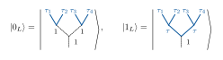
  </picture>
</p>

Only the pairwise fusion-channel combinations $(1,1)$ and $(\tau,\tau)$ are
compatible with total vacuum. Thus $0_L$ and $1_L$ label two fusion trees, not
individual physical qubits. An exchange within either created pair is diagonal
in this basis:

$$
\sigma_1|x_L\rangle=R^{\tau\tau}_x|x_L\rangle,
\qquad x\in\{1,\tau\},
$$

and $\sigma_3$ acts in the same way on the second pair for the same braid
orientation.

To exchange the middle anyons, an $F$-move changes to a tree in which
$\tau_2$ and $\tau_3$ fuse first, the $R$-move exchanges them, and the inverse
$F$-move returns to the measurement tree. Hence
$\sigma_2=F^{-1}RF$ and

$$\sigma_2|0_L\rangle=\varphi^{-1}e^{4\pi i/5}|0_L\rangle+\varphi^{-1/2}e^{-3\pi i/5}|1_L\rangle.$$

For one middle exchange, fusion is therefore expected to give

$$
P(0_L)=\varphi^{-2},
\qquad
P(1_L)=\varphi^{-1},
\qquad
\frac{P(1_L)}{P(0_L)}=\varphi.
$$

After fuse-back, the two fusion-output qubits record the pair channels:
$00$ represents $(1,1)$, or $|0_L\rangle$, and $11$ represents
$(\tau,\tau)$, or $|1_L\rangle$. These readout qubits remain correlated with
the rest of the lattice; the mixed outcomes $01$ and $10$ have zero ideal
weight because the four anyons have total vacuum charge. The exact
three-plaquette Qiskit statevector calculation in
[`levin_wen_braiding.py`](fibonacci/main_scripts/levin_wen_lattice/levin_wen_braiding.py)
reproduces this prediction. The calculated fusion probabilities are:

| Braid word | $P(00)=P(0_L)$ | $P(11)=P(1_L)$ |
|:---|---:|---:|
| $I,\ \sigma_1,\ \sigma_3,\ Z=\sigma_1^5$ | $1.000000$ | $0.000000$ |
| $\sigma_2,\ \sigma_1\sigma_2,\ \sigma_2\sigma_1\sigma_2$ | $0.381966$ | $0.618034$ |
| $\sigma_2^2$ | $0.145898$ | $0.854102$ |
| $\sigma_2^3$ | $0.909830$ | $0.090170$ |
| 30-exchange $H$ approximation | $0.504043$ | $0.495957$ |
| 65-exchange $X=HZH$ approximation | $0.000096$ | $0.999904$ |

The 30-exchange $H$ approximation in the table is the braid below; circuit
time runs from left to right:

<p align="center">
  <picture>
    <source media="(prefers-color-scheme: dark)"
            srcset="docs/images/fibonacci/diagrams/braid_word_hadamard_tikz_dark.svg">
    <source media="(prefers-color-scheme: light)"
            srcset="docs/images/fibonacci/diagrams/braid_word_hadamard_tikz.svg">
    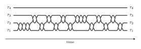
  </picture>
</p>

The outer exchanges are diagonal in this basis, and $\sigma_1^5=Z$ exactly.
Consequently, they leave the initial fusion outcome unchanged.

### Circuit transpilation and optimization

Categorical $F$-, $R$- and ribbon operations naturally produce
multi-controlled gates, so direct decomposition is expensive on present-day
hardware. The Qiskit implementation therefore includes several circuit- and
gate-level optimizations.

The topology-study tools search for efficient hardware implementations on a
configurable set of IBM backends. They allow the initial logical-to-physical qubit mapping to be specified manually and compare it directly with Qiskit’s automatic qubit placement.
For each circuit and backend, they transpile across a range of seeds
to reduce routing overhead. Candidates are ranked first by two-qubit gate
count, then by circuit depth and one-qubit gate count.

For each backend, circuit and layout, the best transpilation and its associated metadata are saved under
[`fibonacci/transpiled_circuits`](fibonacci/transpiled_circuits). Run the hardware-transpilation studies with:

```bash
python -m fibonacci.main_scripts.topological_code.ibm_backend_topology_study
python -m fibonacci.main_scripts.levin_wen_lattice.ibm_backend_topology_study
```

Companion scripts generate figures from the saved results, including
comparisons of two-qubit gate counts, circuit depths and one-qubit gate counts,
as well as maps of the automatic and manual qubit placements on the full
backend topology:

```bash
python -m fibonacci.main_scripts.topological_code.ibm_backend_topology_generate_figures
python -m fibonacci.main_scripts.levin_wen_lattice.ibm_backend_topology_generate_figures
```

The opening summary figure shows a transpilation-cost comparison across braid
words. The figure below shows the full-backend placements for the Levin–Wen
plaquette-$B$ measurement circuit.

<p align="center">
  <picture>
    <source media="(prefers-color-scheme: dark)"
            srcset="docs/images/fibonacci/transpilation/transpilation_plaquette_b_layout_map_dark.svg">
    <source media="(prefers-color-scheme: light)"
            srcset="docs/images/fibonacci/transpilation/transpilation_plaquette_b_layout_map.svg">
    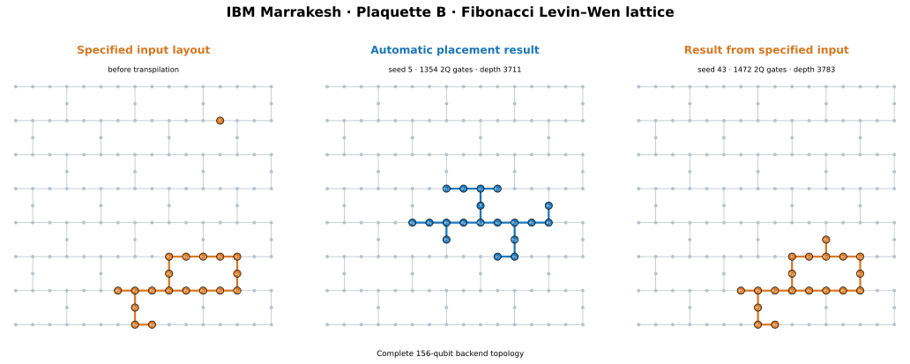
  </picture>
</p>

### Mathematica calculations

The Mathematica notebooks provide useful tools for studying Levin–Wen models
using standard graphical string-net representations of the states. They allow
us to visualize the action of quantum gates on these states and thereby verify
the circuits used in the Qiskit implementation.

The notebook
[`fibonacci_string-net_from_F-symbols.nb`](fibonacci/Mathematica/fibonacci_string-net_from_F-symbols.nb)
constructs string-net amplitudes directly from the fusion data, determining the
desired states. The notebook
[`fibonacci_string-net_from_quantum-gates.nb`](fibonacci/Mathematica/fibonacci_string-net_from_quantum-gates.nb)
prepares the same states using explicit gate sequences, allowing those
sequences to be checked graphically.

Quantum states and gate operators are represented internally using sparse
arrays and matrices.

#### Graphical gate check

The following example shows the gate sequence used to prepare the
three-plaquette ground state and the resulting graphical string-net
superposition:

<p align="center">
  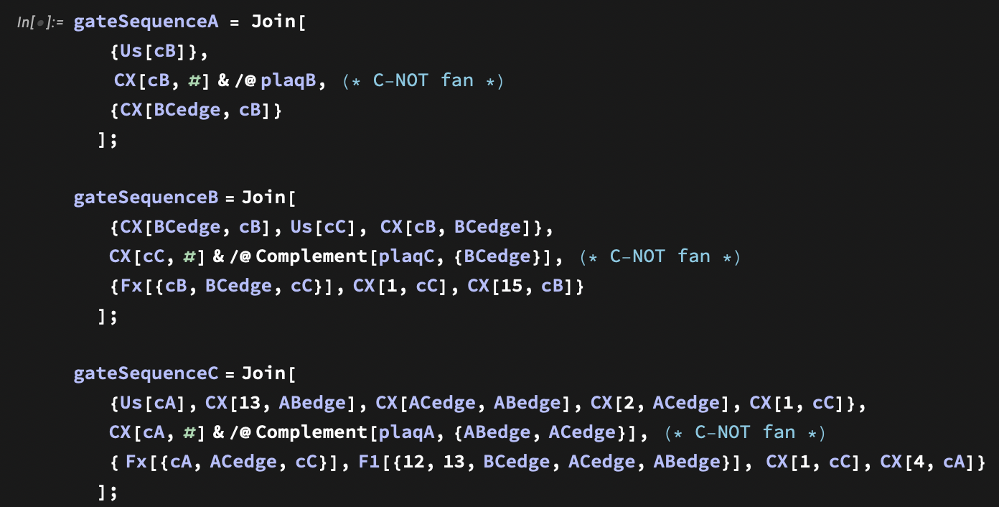
</p>

<p align="center">
  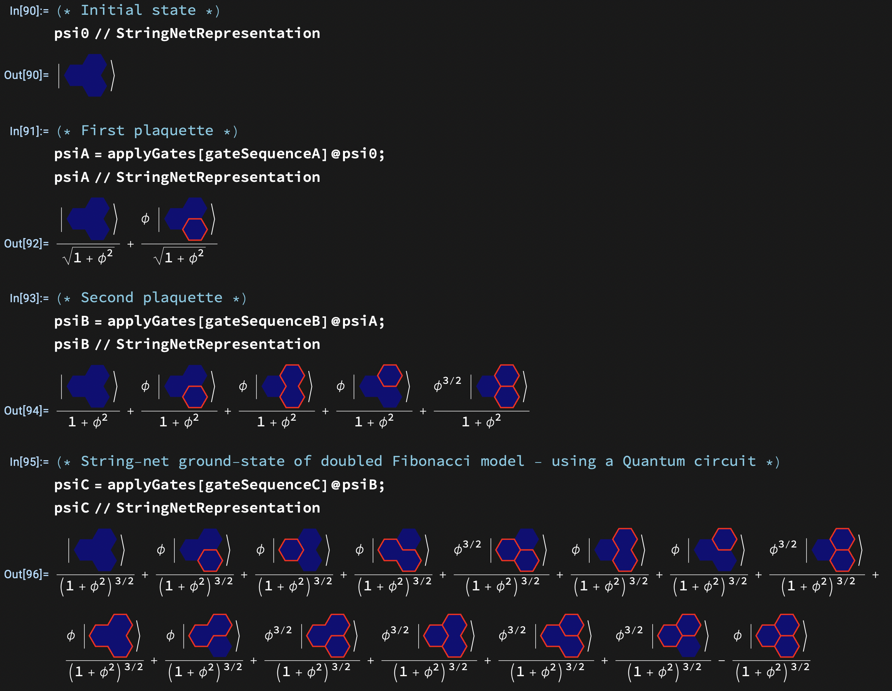
</p>

The `StringNetRepresentation` function converts the nonzero amplitudes of a
sparse state into a weighted sum of graphical string-net configurations.

#### Graphical Fibonacci Tube Algebra

The Levin-Wen edge labels come from $\mathcal C$, but its bulk charges (anyons) belong
to the center $Z(\mathcal C)$. An object of the center is a pair
$(X,\gamma_X)$, where the compatible half-braiding $\gamma_X$ moves $X$
consistently through every string label.

The center can be computed from the so-called tube algebra.
Physically,
$\mathrm{Tube}(\mathcal C)$ is the algebra of local string-net operators
supported on an annulus surrounding a puncture. These operators probe and
manipulate the topological charge enclosed by the annulus without accessing
its interior. Graphically, a basis element is a fusion-allowed labelled
string net drawn on an annulus, or equivalently on the surface of a cylinder.
Multiplication corresponds to stacking two cylinders and reducing the joined
string net using the fusion and $F$-move rules.

The irreducible representations of the tube algebra classify the bulk anyons:

$$
Z(\mathcal C)\simeq
\mathrm{Rep}\left(\mathrm{Tube}(\mathcal C)\right).
$$

Its minimal central idempotents act as projectors onto definite topological
charges and can therefore be viewed as measurements of the anyon sector inside
the annulus.

The notebook
[`Tube_Algebra_Fibonacci.nb`](fibonacci/Mathematica/Tube_Algebra_Fibonacci.nb)
provides tools for exact calculations in $\mathrm{Tube}(\mathcal C)$ and
for visualizing its elements. The functions `TubeRepresentation` and
`TubeRepresentation3D` render the same element as a two-dimensional annular
diagram and as a three-dimensional cylinder, respectively. For example, the
Dehn-twist element appears as

<p align="center">
  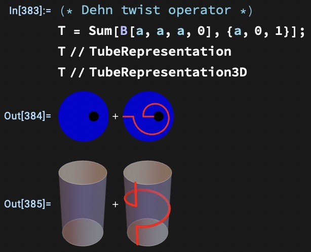
</p>

Products in $\mathrm{Tube}(\mathcal C)$ also have a direct graphical
interpretation: compatible cylinders are stacked, and the joined boundary is
reduced using $F$-moves:

<p align="center">
  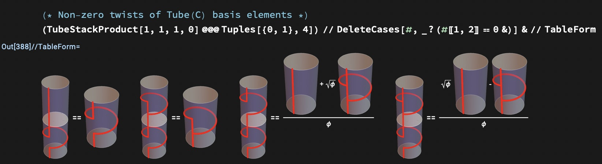
</p>

The half-braiding representations yield four mutually orthogonal minimal
central idempotents:

$$
\Pi_\mu\Pi_\nu=\delta_{\mu\nu}\Pi_\mu.
$$

In the notebook, we compute the minimal central idempotents to identify the
distinct anyonic ribbon-operator sectors of the Levin–Wen model. Each
idempotent projects onto a simple representation and thereby selects one of
the four doubled-Fibonacci anyon sectors.

<p align="center">
  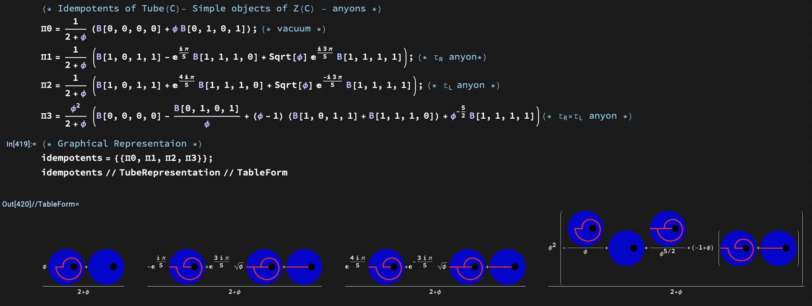
</p>

The central Dehn twist acts diagonally on these sectors:

$$
T\Pi_\mu=\theta_\mu\Pi_\mu.
$$

The corresponding eigenvalues are their topological spins, in the sector
order given above:

$$
\left(1,e^{4\pi i/5},e^{-4\pi i/5},1\right).
$$


## Toric code

### Ground-state preparation and modular matrices

The toric-code circuit prepares a ground state on a three-plaquette lattice by
creating a coherent superposition of closed-loop configurations. Wilson-string
circuits then create, move, exchange and braid the electric ($e$), magnetic
($m$) and composite ($em$) excitations. Hadamard tests extract their exchange
and mutual-braiding phases, from which the modular $T$ and $S$ matrices are
constructed.

The simulation can be run from the repository root with

```bash
python -m toric_code.toric_code_modular_matrix_circuits
```


## Cluster-state SPT phase transition

### Overview

The repository also contains a study of a one-dimensional transition between
a cluster-state symmetry-protected topological (SPT) phase and a trivial
$X$-polarized phase. The parameterized parent Hamiltonian is

$$
H(g)=-\sum_i\left[
2(1-g^2)Z_iZ_{i+1}
+(1+g)^2X_i
-(g-1)^2Z_iX_{i+1}Z_{i+2}
\right].
$$

The cluster fixed point is at $g=-1$, the trivial product-state fixed point is
at $g=1$, and the transition occurs at $g=0$. The state has an exact
bond-dimension-two iMPS representation.


### iMPS and sequential circuit construction

The iMPS representation is used both to calculate thermodynamic-limit
observables and to construct a finite quantum circuit. Its transfer matrices
are

$$
T=\sum_s B^s\otimes B^{s*},
\qquad
E_O=\sum_{s,s'}O_{ss'}B^s\otimes B^{s'*}.
$$

The two different phases can be distinguished by two complementary string order-parameters:

$$
S_1=X_1X_2\cdots X_\ell,
\qquad
S_{ZY}=Z_1Y_2X_3\cdots X_{\ell-2}Y_{\ell-1}Z_\ell.
$$

$S_{ZY}$ is non-zero in the cluster SPT phase, while $S_1$ is non-zero on the
trivial side. The same iMPS is converted into a sequential Qiskit preparation
circuit: a boundary gate $U_1(g)$ initializes the virtual degrees of freedom,
and repeated two-qubit gates $U(g)$ generate one physical site at a time while
propagating the bond ancilla along the chain.
Companion Mathematica calculations derive the exact iMPS and transfer-matrix
string correlators, analyze the cluster-state Hamiltonian, and symbolically
verify the parameterized gate decompositions used by this circuit.


### String-order measurements

The string observables are measured in two ways:

- **Direct measurement:** rotate each local Pauli operator into the $Z$ basis
  and extract the string expectation from the measured bitstring parity.
- **Indirect measurement:** use a Hadamard-test ancilla to control the complete
  Pauli string and read its expectation from the ancilla.

The figure below compares both shot-based Qiskit Aer measurements for a
four-site circuit with the infinite-MPS transfer-matrix result.

<p align="center">
  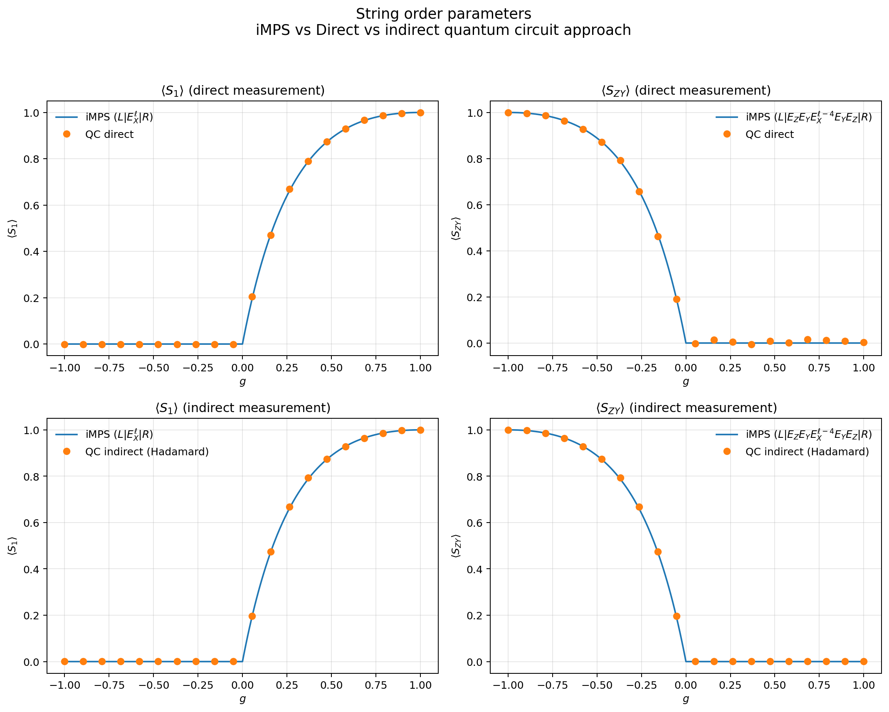
</p>
